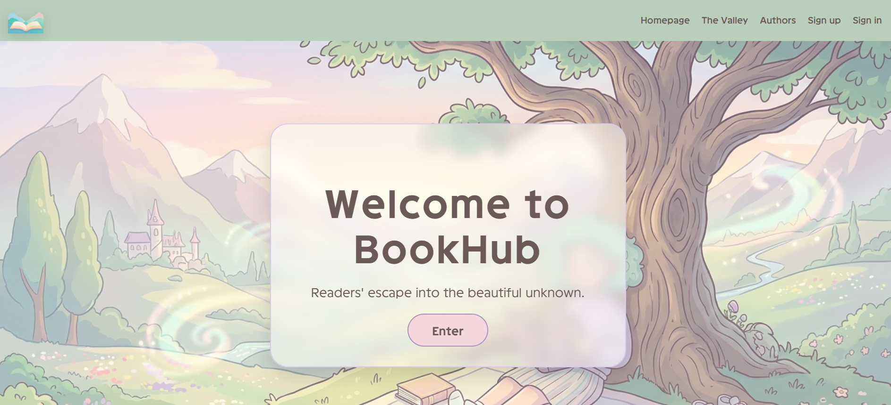
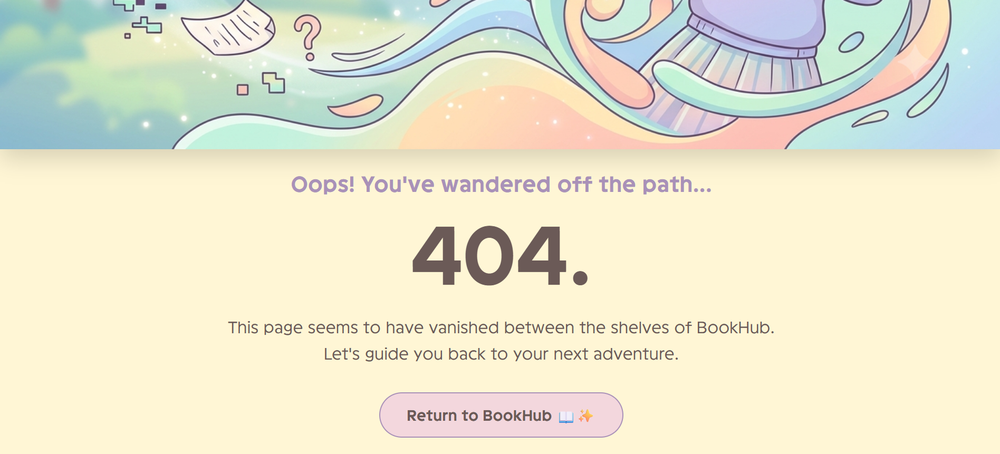
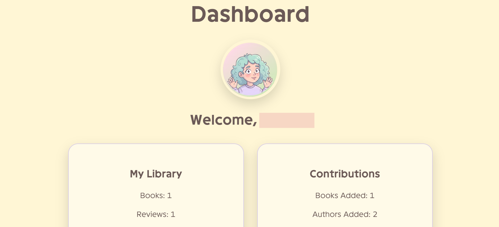
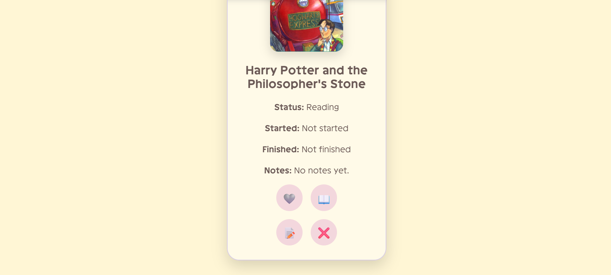
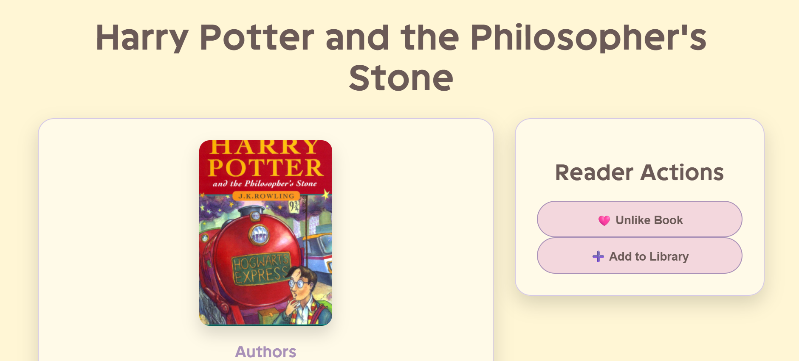
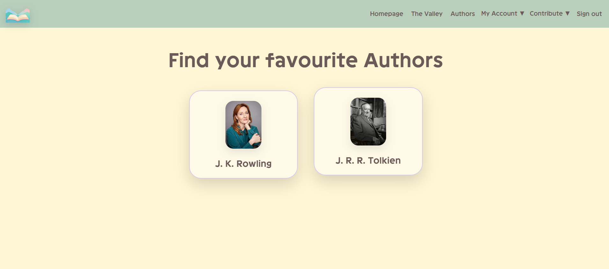
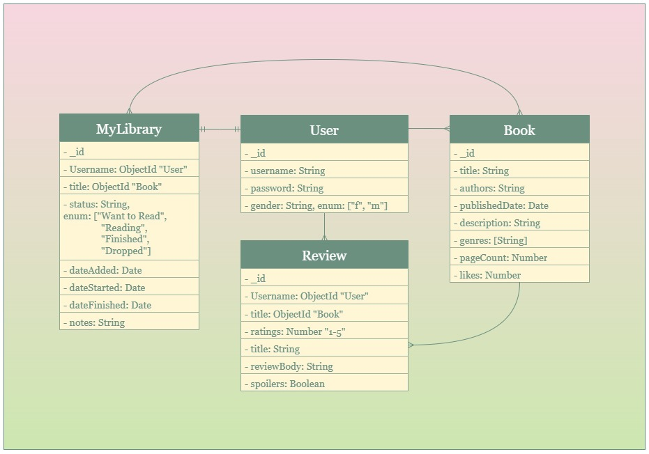

# BookHub 📖✨

## Description
BookHub is readers' source for *discovering*, *organizing*, and *sharing* books. Users can browse books, build a personal library, track their reading progress, write reviews, rate books, and connect with a community of readers in one place 🤩💫

## Features
- Create and manage a BookHub account.
- Browse and review books in The Valley.
- Follow your favourite authors.
- Build and organize your personal library.
- Track your reading progress and save notes.
- Like books and write reviews.
- Contribute new books and authors.
- View your activity and statistics through the Dashboard.
- Admins can manage book and author entries.

## Screenshots
📸 **Homepage:**

📸 **Error 404:**

📸 **Dashboard:**

📸 **My Library:**

📸 **The Valley:**

📸 **Authors:**

## User Stories
- As a user, I want to see a clear homepage with easy navigation.
- As a user, I want to create an account.
- As a user, I want to be able to log in and out whenever I want.
- As a user, I want to be able to browse books without logging in.
- As a user, I want to be able to add books to the app.
- As a user, I want to be able to rate books.
- As a user, I want to be able to review books.
- As a user, I want to know whether reviews contain spoilers.
- As a user, I want to have a private library where I can add my books.
- As a user, I want to be able to add notes to my books.
- As a user, I want to be able to timestamp my book status updates.
- As a user, I want to be able to update the status of my books (e.g., Finished, Reading, etc.).

## Technologies Used
1. HTML
2. CSS
3. JavaScript
4. Node.js with Express
5. MongoDB

## Database Design

## BookHub Routes
### Homepage

| Method | Route | Description |
|--------|-------|------------|
| GET | `/` | Displays the BookHub homepage. |

### Authentication

| Method | Route | Description |
|--------|-------|------------|
| GET | `/auth/sign-up` | Displays the registration form. |
| POST | `/auth/sign-up` | Creates a new user account. |
| GET | `/auth/sign-in` | Displays the sign-in form. |
| POST | `/auth/sign-in` | Authenticates and signs in a user. |
| GET | `/auth/sign-out` | Signs the current user out. |

### User Dashboard

| Method | Route | Description |
|--------|-------|------------|
| GET | `/dashboard` | Displays the user's dashboard. |
| POST | `/dashboard/change-password` | Updates the user's password. |
| GET | `/dashboard/:id/confirm-delete` | Displays the account deletion confirmation page. |
| PUT | `/dashboard/:id/delete` | Permanently deletes the user's account. |

### My Library

| Method | Route | Description |
|--------|-------|------------|
| GET | `/mylibrary` | Displays all books in the user's library. |
| POST | `/mylibrary/:bookId` | Adds a book to the user's library. |
| GET | `/mylibrary/:id/edit` | Displays the reading progress update form. |
| PUT | `/mylibrary/:id/edit` | Updates the reading status, dates, and notes of a library entry. |
| DELETE | `/mylibrary/:id` | Removes a book from the user's library. |
| POST | `/mylibrary/:id/favorite` | Toggles a book's favorite status. |
| POST | `/mylibrary/:id/finish` | Marks a book as finished reading. |

### Authors

| Method | Route | Description |
|--------|-------|------------|
| GET | `/authors` | Displays all authors. |
| GET | `/authors/new` | Displays the add author form. |
| POST | `/authors` | Creates a new author entry. |
| GET | `/authors/:id` | Displays an author's details and bibliography. |
| DELETE | `/authors/:id` | Deletes an author (Admin only). |
| POST | `/authors/:id/follow` | Follows an author. |
| POST | `/authors/:id/unfollow` | Unfollows an author. |

### The Valley (Books)

| Method | Route | Description |
|--------|-------|------------|
| GET | `/valley` | Displays all books in The Valley. |
| GET | `/valley/new` | Displays the add book form. |
| POST | `/valley` | Creates a new book entry. |
| GET | `/valley/:id` | Displays a book's details, reviews, and reader actions. |
| DELETE | `/valley/:id` | Deletes a book (Admin only). |
| POST | `/valley/:id/like` | Likes a book. |
| POST | `/valley/:id/dislike` | Removes a like from a book. |

### Reviews

| Method | Route | Description |
|--------|-------|------------|
| POST | `/reviews/:bookId` | Creates a review for a book. |
| PUT | `/reviews/:id` | Updates an existing review. |
| DELETE | `/reviews/:id` | Deletes a review. |

## Future Enhancements
Some planned improvements for BookHub include:

- Implement a search bar for books and authors.
- Add filtering and sorting options by genre, publication date, and popularity.
- Display average ratings for books based on user reviews.
- Allow users to upload custom profile pictures.
- Add bios and public profiles.
- Implement email verification and password reset functionality.
- Create personalized book recommendations based on users' libraries and liked books.
- Add badges and reading achievements for users.
- Improve responsiveness for mobile and tablet devices.
- Allow users to edit their contributed books and authors.
- Add dark mode support.

## Attributions
The following resources were used throughout the development of BookHub:

- Icons provided by Unicode Emojis.
- Books and author images are used solely for educational purposes.
- Inspiration for the pastel fantasy-inspired user interface was drawn from modern digital library and reading-tracker applications.

## Credits
BookHub was designed and developed by **Zahera H.** as part of General Assembly's Software Engineering Bootcamp.

Special thanks to:

- General Assembly instructor **Omar** and his assistant team.
- Fellow students and peers who provided feedback during development.

## License
This project is open source. You are welcome to view, study, use, modify, and distribute the project for personal, educational purposes, provided that appropriate credit is given to the original author.